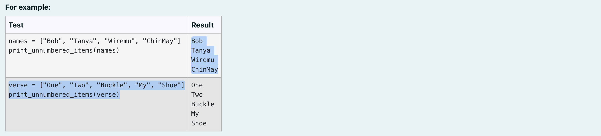
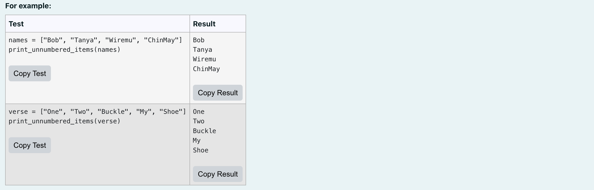
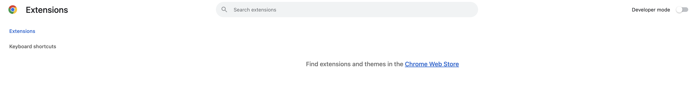
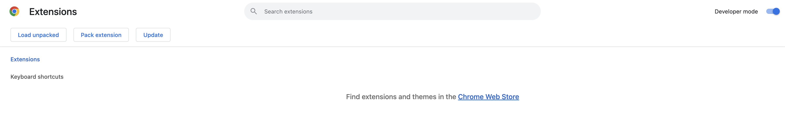
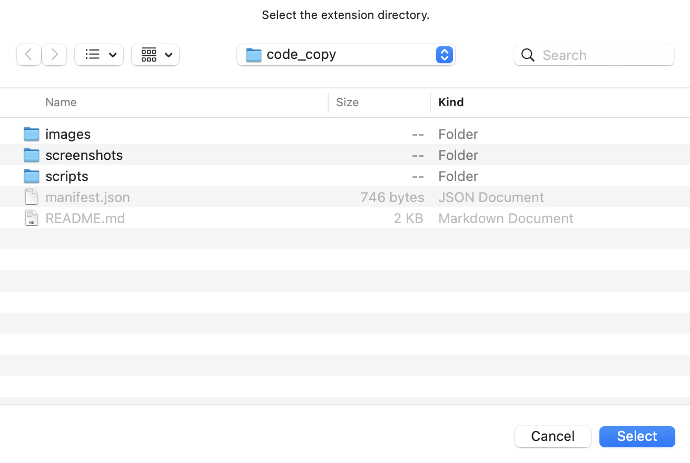

# Code Copy
This small project was built to combat the annoyances of copying and pasting test code given in the programming quizzes that are part of University of Canterbury's quizzes. This was made with plain JavaScript.

The codebase is an extension usable with the Google Chrome browser.

Note: This extension only works for quizzes made by the University of Canterbury. The javascript is only injected to specific sites that these quizzes are run on.

## Table of Contents

- [Purpose](#purpose)
- [How to Use](#how-to-use)
- [Installation](#installation)
- [Contact](#contact)

## Purpose
With tutoring an introduction to programming course, I saw the struggle my students had with copying and pasting each and every test given to check if the code they created worked as expected.

With so many questions in these beginner programming courses and so many tests provided, this error has annoyed most. This extension takes this small but multiplied irritation and replaces it with a button that copies this test to your system's clipboard.

## How to Use

1. Install the extension as outlined in [Installation](#installation).
2. Navigate to the quiz on either Learn or Quiz Server. Reminder to reload if the quiz is already in a tab before installing.
3. Use the "Copy Test" and "Copy Result" buttons. Copy tests to run and copy results into a text comparator to check your results against the expected results.

Note: Future developments are looking into developing a smart Python test functionality.

## Installation
1. Download the repository into a local folder of your choice.
2. Navigate to [Chrome Extensions](chrome://extensions/).

3. Turn "Developer Mode" on to unlock more extension features.

4. Select the "Load unpacked" and use your system's location selector to select the extension's location.

## Contact
Please send [nalombrodev@gmail.com](mailto:nalombrodev@gmail.com) an email with any feedback on this small-scale project.
